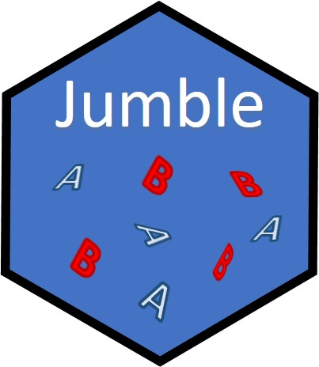

jumble: An R Package to perform stratified and re-randomization procedures and assess covariate balance
===============

# Overview  
This package is practical companion to the published work of statisticians such as Kari Morgan Lock and Donald Rubin on how to perform a 're-randomization' procedure. The overall purpose is provide an easy to use suite of functions for assigning individuals /units in randomized clinical trials. Consideration is given also to transparency and reporting for regulatory purposes.  

# Installation  
```{r, eval=F}
# install from CRAN: (Not implemented yet)
install.packages("jumble")
```
# Or the the development version from GitHub:
# install.packages("devtools")
```{r, eval=F}
devtools::install_github("kmcconeghy/jumble")
```
This package relies heavily on the suite of packages and programming termed "Tidyverse", and "data.table" e.g. that must be installed for proper functioning.  

# Usage  
Interested users should have a cohort of trial subjects to use with this package. The package functions will iteratively assign K treatments (currently only trials with two treatments can be evaluated), assess balance according to the Mahalanobis distance, then re-randomize if M-distance < minimum acceptable criteria. The criteria, or cut-off, can either be selected assuming M-distance is geometrically distributed with k degrees of freedom where k is the number of covariates. In this case the user can select an arbitrary acceptance probability. Or the user can use ancillary functions to generate an empirical distribution of M, and choose thier own cut-off.  

# Vignettes  
Companion documents have been written to assist interested readers with the background and use of the package.  

- Mahalanobis distance measures  
This explains one of common measures used to demonstrate covariate balance and how it can be deployed in randomization procedures  
```{r, eval=F}
vignette("01-mahalanobis", "jumble")
```

- Re-randomization  
Goes over a particular re-randomization method using the Mahalanobis distance measures  
```{r, eval=F}
vignette("02-rerand", "jumble")
```

- Assignment   
Explains some of the underlying sampling functions which drive randomization  
```{r, eval=F}
vignette("03-assignment", "jumble")
```

- Stratification   
Examples for how to perform stratified randomizations  
```{r, eval=F}
vignette("04-stratification", "jumble")
```

# Latest Version Updates  
This package is in the early stages of development. Many features may change in a short amount of time.  

# Future Goals for jumble  
- Allow for arbitrary number of treatment groups
- Expand balance measures beyond Mahalanobis

# Important References   
 1. Morgan KL, Rubin DB. Rerandomization to Balance Tiers of Covariates. J Am Stat Assoc. 2015; 110(512): 1412–1421. [Pubmed Link](https://www.ncbi.nlm.nih.gov/pmc/articles/PMC5042467/)  

# Authors  
Kevin W. McConeghy, Pharm.D, M.S., Brown University School of Public Health, Dept. Health Services Research  
